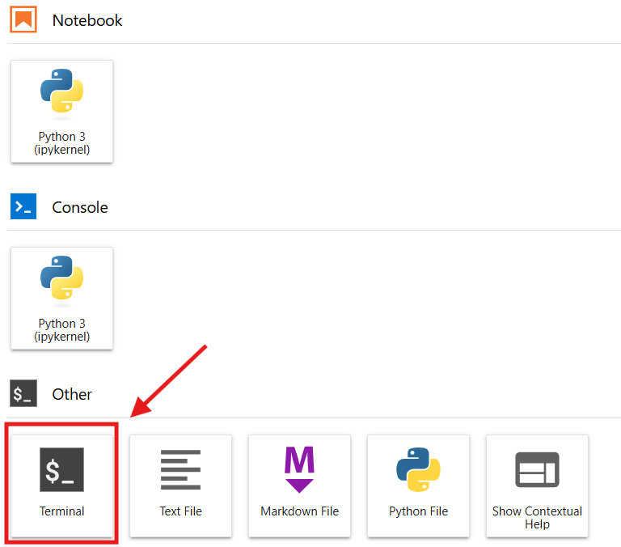

## Guidelines for Contribution

### Contact
For questions regarding this repository, the interaction of this repository with the ICRN, and 
issues or problems around automation, and exposure of custom kernels to users, please contact 
[Christopher Heller](mailto:cheller@illinois.edu).

For questions regarding individual kernels, their current version, and updates, please contact the individual listed in 
the kernel description documentation.

### Using Custom Kernels in the ICRN

Sketch:
#### logging into ICRN 
The ICRN is a resource available to all University of Illinois students and researchers. For more information on how to 
log in to and use this service, please see the [NCSA's documentation](http://www.google.com).

#### Accessing the command line from the ICRN
In order to fully leverage the custom Kernels hosted by NCSA, you will very likely need to run a few commands directly on the command line. This is relatively simple to access from the ICRN, and can be found by opening a new launcher:


Use the 'terminal' option on this screen to open a command line prompt via the ICRN.

#### locate custom kernel environment listing
At any given time, the custom Kernels hosted by the NCSA are listed in this directory:

```/sw/icrn/jupyter/icrn_ncsa_resources/icrn_ncsa_managed_environments```

And they can be listed by running the following command:

```ls -lhart /sw/icrn/jupyter/icrn_ncsa_resources/icrn_ncsa_managed_environments```

#### Activate the custom Kernel
In order to use the custom Kernel, you will first need to create your own copy of it, and then you will need to install it in your jupyter lab.
This can be accomplished by running the following commands.

First, create a directory where you will keep your own custom kernels:

```mkdir ~/ICRN_custom_kernels/```

then, for a custom kernel named "IRC425", run the following command:

``` conda create -p ~/ICRN_custom_kernels/IRC425 --clone /sw/icrn/jupyter/icrn_ncsa_resources/icrn_ncsa_managed_environments/IRC425/latest/```

Please keep in mind that hosted Kernels may change at any time. Updating these kernels is the responsibility of their maintainer. Creating a clone of the kernel ensures that your work will not be disrupted by updates to kernels.

After creating your own copy of the kernel, you must install it in your jupyter environment.

First, activate the kernel in your conda environment manager:

``` conda activate ~/ICRN_custom_kernels/IRC425```

and then, install it in your jupyterlab instance by running:

``` python -m ipykernel install --user --name IRC425-latest --display-name=IRC425-latest```

This kernel will be installed in your jupyterlab on the ICRN until you un-install it, via this command:

```jupyter kernelspec uninstall irc425-latest```

The list of kernels you currently have installed can be seen in the Jupyterlab interface, or on the command line by running:

```jupyter kernelspec list```


### Kernel organization
Each custom kernel should be contained with a directory under ./Kernels/ and should have a short but descriptive name 
relevant to individuals outside of the project. Ideally, these custom kernels are maintained through a CI pipeline and will not require manual updates.

Prior to pull requests integrating new custom kernels into the overall list of maintained kernels, the listing in the 
main readme should be expanded with the required information, as tabulated below.

### Workflow

1. Create a subdirectory for your kernel within the [kernels directory](./Kernels/)
2. create an 'update.sh' file that contains all of the needed commands to build and install your kernel as a custom ipy kernel
3. if your project has git submodules; create a 'tags.json' file which identifies the repositories and their branch/version leveraged by the custom kernel
4. include necessary git automation to checkout the appropriate branches/commits for each of the git submodules
5. create an entry in the kernel listing in the [kernels readme](./Kernel_listing.md)


### Template Kernel Definition (Use me for your next kernel!)
| Field        | Value                                       |
|--------------|---------------------------------------------|
| Kernel Name  | novel_custom_kernel                         |
| Version      | 1.0.0                                       |
| Contact      | email@emailhost.com                         |
| Project      | IRC425                                      |
| Description  | Kernel in support of root modeling software |
| expiration   | Kernels are supported for 1 year by default |
| last updated | 12/9/2024                                   |